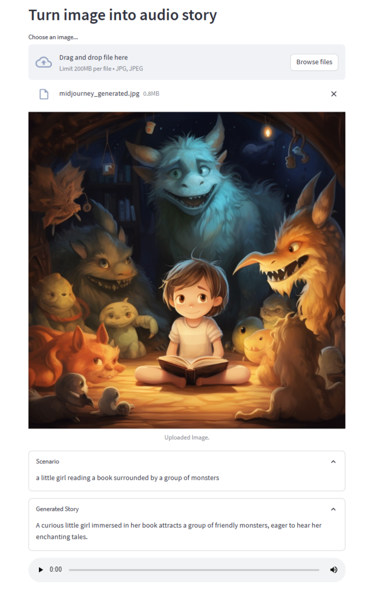

# Image to Audio Story Converter

Convert images into captivating audio stories using a combination of image-to-text, language models, and text-to-speech technologies.



## Introduction
This project allows you to turn images into audio stories. It employs image-to-text conversion, language models, and text-to-speech synthesis to create an engaging experience. Extract text from uploaded images, generate short stories based on the extracted text, and listen to the generated stories as audio clips.

## Setup
1. **Clone the Repository**:
   ```sh
   git clone https://github.com/fshnkarimi/Image2AudioStoryConverter.git
   cd Image2AudioStoryConverter
   ```

2. **Install Dependencies**:
   ```sh
   pip install -r requirements.txt
   ```

3. **Set Up Environment Variables**:
   Create a `.env` file in the project directory and add your Hugging Face API token:
   ```
   HUGGINGFACEHUB_API_TOKEN=your_token_here
   ```

## Usage
1. **Run the Streamlit App**:
   ```sh
   streamlit run app.py
   ```

2. **Upload an Image**:
   - Use the interface to upload an image.
   - The app will process the image, extract text, and generate a story.

3. **Experience the Story**:
   - View the extracted scenario and the generated story in expandable sections.
   - Listen to the generated story as an audio clip.

## Dependencies
- [transformers](https://huggingface.co/transformers/)
- [langchain](https://www.langchain.com/)
- [requests](https://pypi.org/project/requests/)
- [streamlit](https://streamlit.io/)

## Contributing
Contributions are welcome! If you'd like to contribute to this project, please follow these steps:
1. Fork this repository.
2. Create a new branch for your feature or bug fix.
3. Make your changes and submit a pull request.

---

Enjoy turning your images into captivating audio stories! Feel free to customize and enhance this project as you see fit. If you have any questions or ideas for improvement, please don't hesitate to get in touch.
